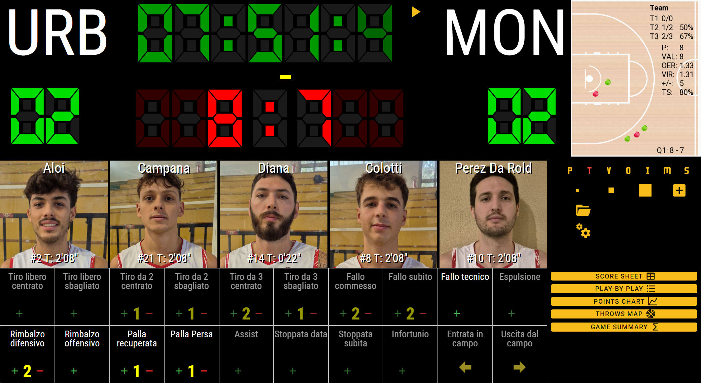
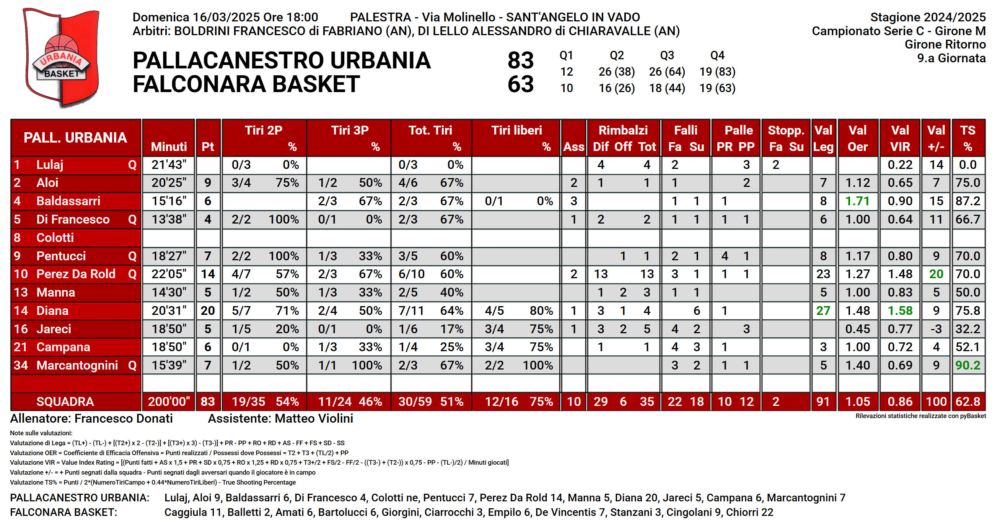
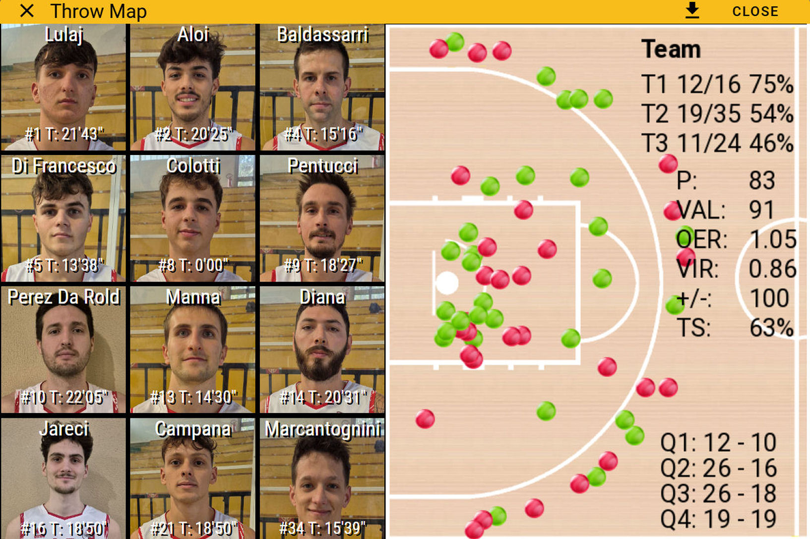

# pyBasket
Basketball statistics in Python and Voilà

## Output web site produced by pyBasket
[pyBasket site on daigio.it](https://www.daigio.it/pybasket/)

## Screenshot

## Outputs produced by pyBasket

### Score Sheet

### Play-By-Play

### Points Chart

### Throws Map

